# Звіт з лабораторної роботи №6

## Загальна інформація
- ПІБ студента: Поліщук Андрій Володимироіич
- Група: ІПЗ-32
- Рівень виконання: 3

## Хід виконання

### 1. Створення бази даних та колекцій

```javascript
// Перемикання на нову базу даних (створюється автоматично)
use library

// Створення колекцій з валідацією
db.createCollection("books", {
  validator: {
    $jsonSchema: {
      bsonType: "object",
      required: ["title", "author", "publication_year"],
      properties: {
        title: { bsonType: "string" },
        author: { bsonType: "string" },
        publication_year: { bsonType: "int", minimum: 1000 },
        pages: { bsonType: "int", minimum: 1 },
        genres: { bsonType: "array", items: { bsonType: "string" } },
        available: { bsonType: "bool" }
      }
    }
  }
});

db.createCollection("authors");
db.createCollection("users");
```

### Результат:
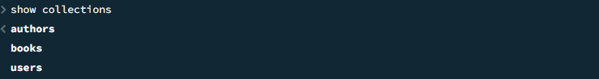

### 2. Заповнення колекцій даними

### Колекція authors
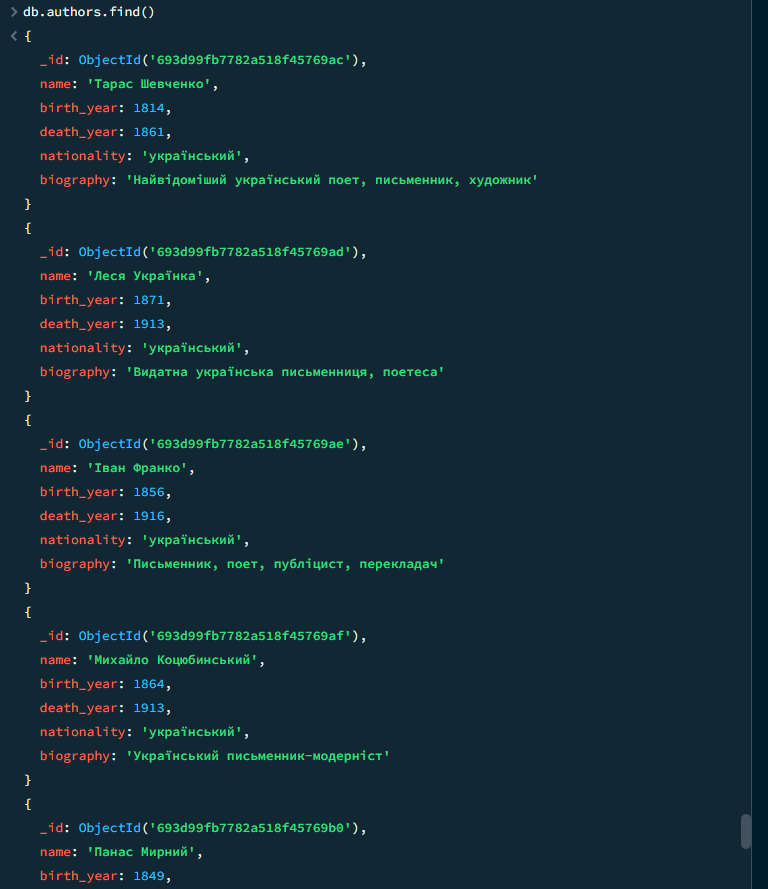
### Колекція books
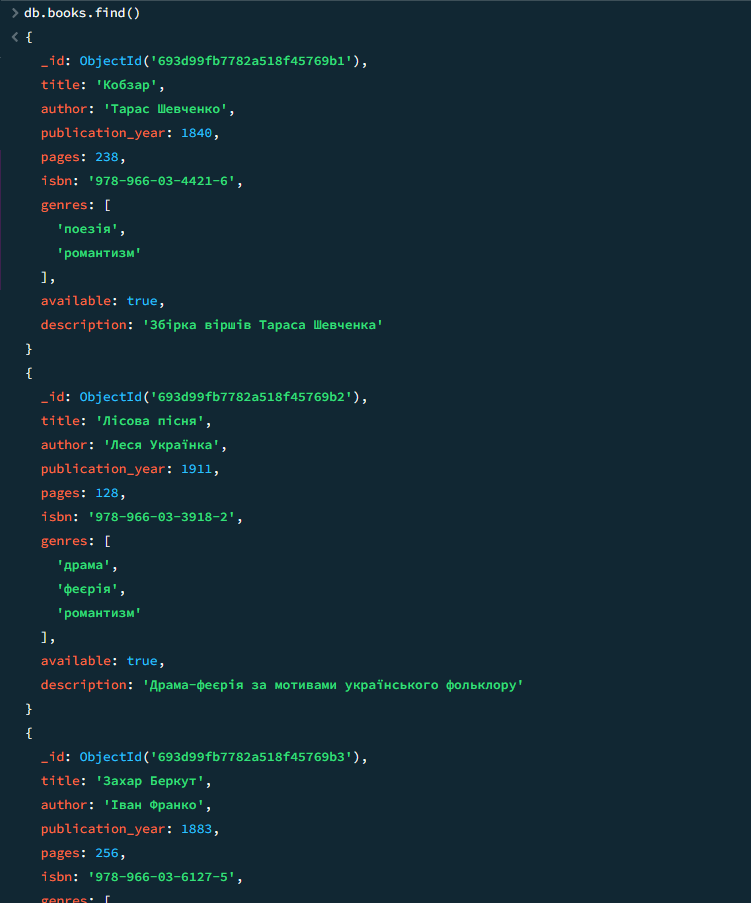
### Колекція users
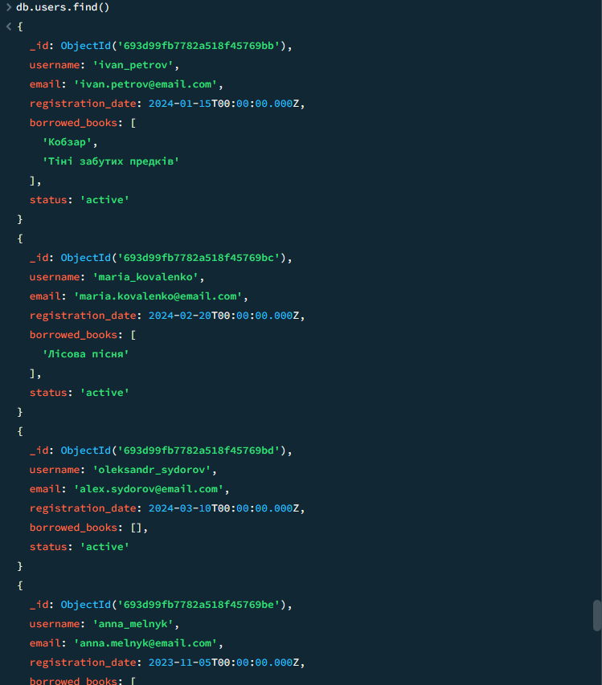

### 3. Базові CRUD операції

- ### Вставка

```json
db.authors.insertOne([
  {
  name: "Поліщук Андрій",
  birth_year: 2008,
  nationality: "український",
  biography: "Найвідоміший, в вузьких колах, письменкик, критик і взагалі талант"
  }
])
```
### Результат:
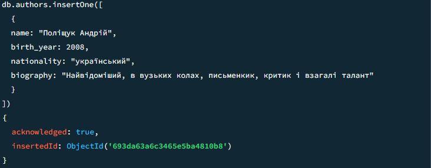
```json
db.books.insertMany([
  {
    title: "Від заліза до радіанта",
    author: "Поліщук Андрій",
    publication_year: 2024,
    pages: 48,
    isbn: "978-966-03-7777-1",
    genres: ["автобіографія", "жахи"],
    available: true,
    description: "Історія про життєвий шлях Поліщука Андрія"
  },
  {
    title: "Від радіанта до заліза",
    author: "Поліщук Андрій",
    publication_year: 2025,
    pages: 48,
    isbn: "978-966-03-6666-2",
    genres: ["автобіографія", "комедія"],
    available: true,
    description: "Історія про творчу кризу Поліщука Андрія"
  }
])
```
### Результат:
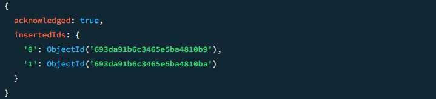

- ### Пошук
```json
db.books.find({
  $and: [
    { genres: "романтизм"},
    { pages: { $gt: 150}}
  ]
})
```

### Результат:
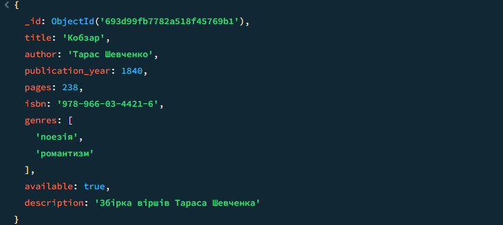

```sql
db.authors.find({
  name: { $regex: /^М/ }
})
```

### Результат:
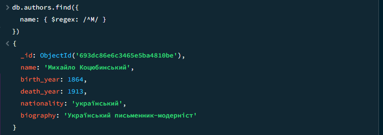

- ### Оновлення
```sql
db.books.updateOne(
  { title: "Від заліза до радіанта" },
  {
    $set: { available: false },        
    $push: { genres: "трилер" }        
  }
)
```

### Результат:
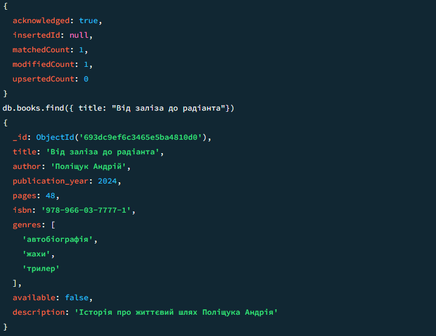


- ### Видалення
```sql
db.books.deleteMany({
  author: "Поліщук Андрій"
})
```
### Результат:
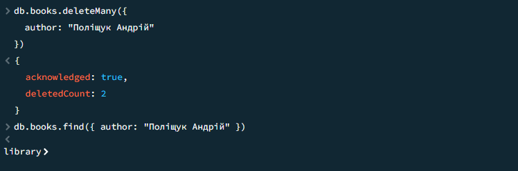

### 3. Індекси та аналіз продуктивності

```json
db.books.find({ publication_year: NumberInt(1911) }).explain("executionStats")
```

```json
db.books.createIndex({ publication_year: 1 })
```


### Результат( ~~IDX~~ | IDX ):
 totalDocsExamined: 10 |  totalDocsExamined: 2,

 ```json
db.books.find({ author: "Іван Франко" }).sort({ title: 1 }).explain("executionStats")
```

```json
db.books.createIndex({ author: 1, title: 1 })
```


### Результат( ~~IDX~~ | IDX ):
 totalDocsExamined: 10 |  totalDocsExamined: 3,

 ```json
db.books.find({ genres: "романтизм" }).explain("executionStats")
```

```json
db.books.createIndex({ genres: 1 })
```


### Результат( ~~IDX~~ | IDX ):
 totalDocsExamined: 10 |  totalDocsExamined: 3,


- ### Складені індески

```json
db.books.createIndex({ author: 1, publication_year: -1 })
```

```json
db.books.createIndex({ genres: 1, title: 1 })
```

Складені індекси дозволяють виконувати пошук і сортування за декількома полями одночасно, значно прискорюючи запити завдяки тому, що дані в індексі вже попередньо впорядковані. Це позбавляє базу даних необхідності сканувати зайві документи та витрачати ресурси на повільне сортування результатів у пам'яті.

### 4. Агрегатні запити

```json
db.books.aggregate([
  // $unwind - Розбиває масив жанрів на окремі документи
  { $unwind: "$genres" },

  // $group - Групуємо по жанру
  {
    $group: {
      _id: "$genres",                   // Ключ групування (назва жанру)
      totalBooks: { $sum: 1 },          // Лічильник книг
      avgPages: { $avg: "$pages" }      // Середнє значення поля pages
    }
  },

  // $sort - Сортуємо за кількістю книг (спаданням -1)
  { $sort: { totalBooks: -1 } }
])
```

### Результат
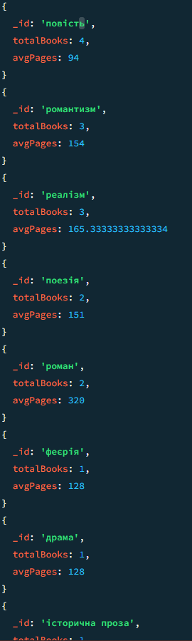

```json
db.books.aggregate([
  {
    $group: {
      _id: "$author",          
      totalBooks: { $sum: 1 }  
    }
  },

  {
    $sort: { totalBooks: -1 }  
  },

  {
    $project: {
      _id: 0,               
      author_name: "$_id",    
      count: "$totalBooks"    
    }
  }
])
```

### Результат
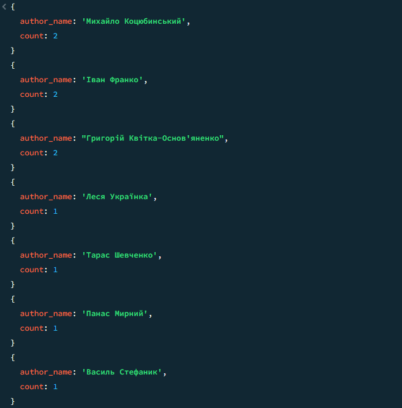

### 5. Текстовий пошук

```json
// 1. Створення текстового індексу
db.books.createIndex({ description: "text" })

// 2. Виконання пошуку
// Шукаємо книги, де в описі є слова "кохання" або "карпати"
db.books.find({ $text: { $search: "кохання карпати" } })
```

### Результат:
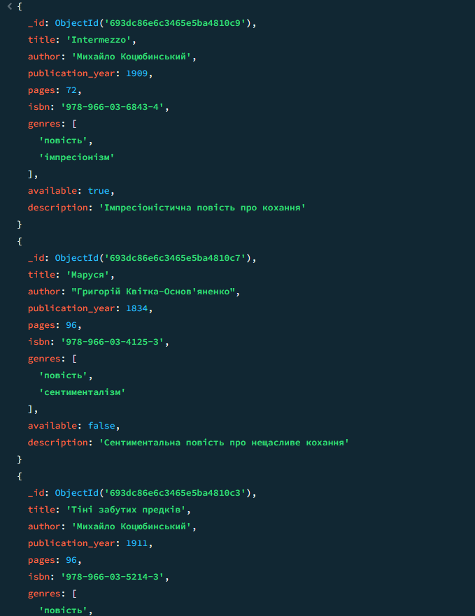

### 6. Текстовий пошук

```json
db.users.aggregate([
  {
    $lookup: {
      from: "books",              
      localField: "borrowed_books", 
      foreignField: "title",      
      as: "book_details"          
    }
  }
]).pretty()
```

### Результат:
Виводить користувача та детальну інформацію про книги, які він взяв

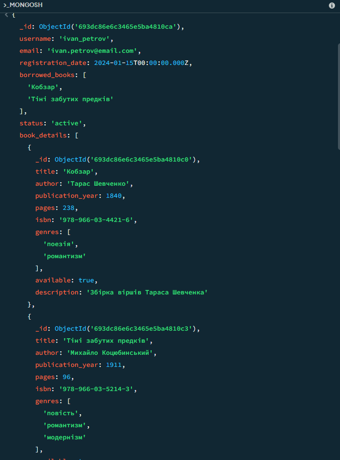

### 7. Представлення

```json
// 1. Створення View
db.createView(
  "available_books_view",    
  "books",                    
  [
    { $match: { available: true } },  
    { $project: { _id: 0, title: 1, author: 1, genres: 1 } } 
  ]
)

// 2. Використання View 
db.available_books_view.find()
```

### Результат
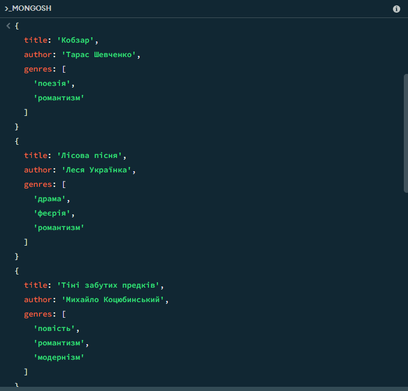

### 8. Валідація схеми

```json
db.runCommand({
  collMod: "books",
  validator: {
    $jsonSchema: {
      bsonType: "object",
      required: ["title", "author", "publication_year", "available"],
      properties: {
        title: {
          bsonType: "string",
          minLength: 1,
          maxLength: 200,
          description: "Назва книги обов'язкова, від 1 до 200 символів"
        },
        author: {
          bsonType: "string",
          minLength: 1,
          description: "Автор обов'язковий"
        },
        publication_year: {
          bsonType: "int",
          minimum: 1000,
          maximum: 2100,
          description: "Рік видання має бути між 1000 та 2100"
        },
        pages: {
          bsonType: "int",
          minimum: 1,
          maximum: 10000,
          description: "Кількість сторінок має бути додатнім числом"
        },
        isbn: {
          bsonType: "string",
          pattern: "^978-\\d{1,5}-\\d{1,7}-\\d{1,7}-\\d{1}$",
          description: "ISBN має відповідати стандартному формату"
        },
        available: {
          bsonType: "bool",
          description: "Доступність обов'язкова"
        }
      }
    }
  },
  validationLevel: "strict"
});
```
### Результат:
```json
db.books.insertOne({
  title: "Тестова книга",
  author: "Тестовий автор",
  publication_year: 3000, // Некоректний рік
  available: true
});
```


### 9. TTL індекс

```json
// 1. Створюємо колекцію 
db.createCollection("user_sessions");

// 2. Створюємо індекс, який "вбиває" запис через певний час
db.user_sessions.createIndex({ "createdAt": 1 }, { expireAfterSeconds: 3600 });

// 3. Додаємо тестовий запис
db.user_sessions.insertOne({
    username: "ivan_petrov",
    session_token: "xyz_secure_token_123",
    createdAt: new Date(), // Важливо: поточний час
    ip: "192.168.1.1"
});
```

### Результат: 
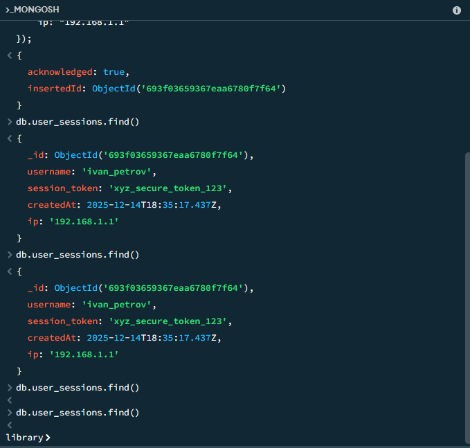

### 9. Сисетма версіонування документів

```json
// Вибираємо книгу для зміни 
var book = db.books.findOne({ title: "Кобзар" });

if (book) {
    // 1. Зберігаємо поточний стан в історію
    db.books_history.insertOne({
        original_book_id: book._id,
        archived_at: new Date(),
        data: book,
        version: book.version || 1
    });

    // 2. Оновлюємо оригінал
    db.books.updateOne(
        { _id: book._id },
        { 
            $set: { pages: 260, last_modified: new Date() },
            $inc: { version: 1 } // Збільшуємо номер версії на 1
        }
    );
    print("Версіонування виконано успішно.");
} else {
    print("Книгу не знайдено.");
}
```

### Результат
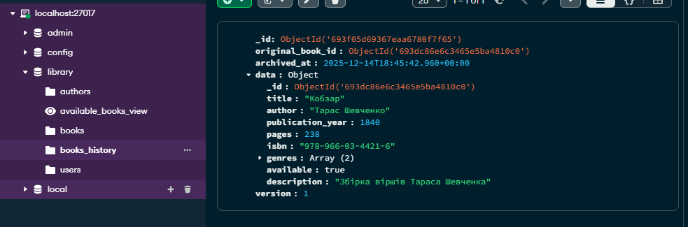

### 10. Повнотекстовий пошук

```json
// Створюємо індекс
db.books.createIndex(
    { title: "text", description: "text" },
    { 
        weights: { title: 3, description: 1 },
        default_language: "none", // Вимикаємо англійську морфологію для коректного пошуку українською
        name: "UkrainianTextIndex"
    }
);

// Тестовий пошук (шукаємо в описі "віршів" або "кохання")
var searchResult = db.books.find(
    { $text: { $search: "віршів кохання" } },
    { score: { $meta: "textScore" } } 
).sort({ score: { $meta: "textScore" } }).toArray();

printjson(searchResult);
```

### Результат:
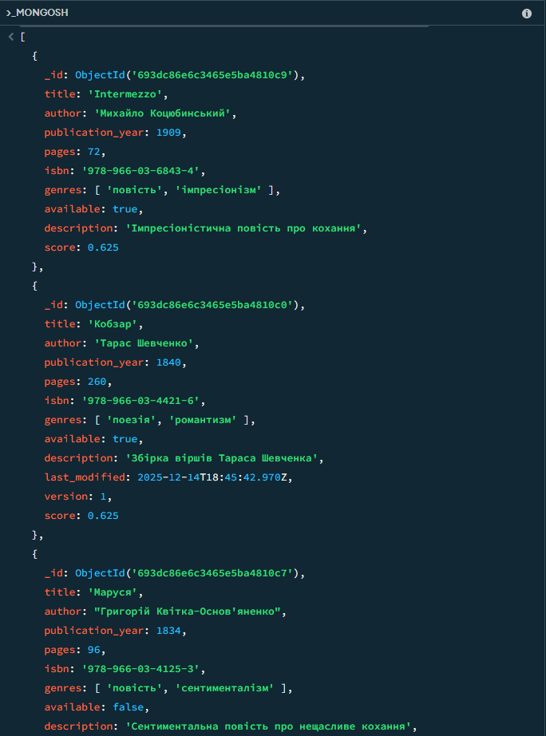

### 11. Порівняльний аналіз

### SQL підхід

```sql
-- Таблиця авторів (окремо, щоб не дублювати дані про автора для кожної книги)
CREATE TABLE authors (
    author_id SERIAL PRIMARY KEY,
    name VARCHAR(100) NOT NULL,
    birth_year INT,
    nationality VARCHAR(50)
);

-- Таблиця жанрів (окремо, бо один жанр мають багато книг)
CREATE TABLE genres (
    genre_id SERIAL PRIMARY KEY,
    genre_name VARCHAR(50) UNIQUE NOT NULL
);

-- Основна таблиця книг (містить посилання на автора)
CREATE TABLE books (
    book_id SERIAL PRIMARY KEY,
    title VARCHAR(200) NOT NULL,
    author_id INT REFERENCES authors(author_id), -- Зв'язок One-to-Many
    publication_year INT,
    pages INT,
    available BOOLEAN DEFAULT TRUE
);

-- Таблиця зв'язку для реалізації Many-to-Many (книга може мати багато жанрів)
CREATE TABLE book_genres (
    book_id INT REFERENCES books(book_id),
    genre_id INT REFERENCES genres(genre_id),
    PRIMARY KEY (book_id, genre_id)
);
```

Запит для отримання повної інформації про доступні книги:
```sql
SELECT 
    b.title, 
    a.name AS author, 
    g.genre_name 
FROM books b
JOIN authors a ON b.author_id = a.author_id
JOIN book_genres bg ON b.book_id = bg.book_id
JOIN genres g ON bg.genre_id = g.genre_id
WHERE b.available = TRUE;
```

### NoSQL підхід

```json
{
  _id: ObjectId("65f1a2b3c4d5e6f7g8h9i0j1"),
  title: "Кобзар",
  // Дані про автора вкладені всередину
  author: {
    name: "Тарас Шевченко",
    birth_year: 1814,
    nationality: "український"
  },

  // Жанри зберігаються простим масивом рядків 
  genres: ["поезія", "романтизм"],
  publication_year: 1840,
  pages: 238,
  available: true
}
```

Запит для отримання повної інформації про доступні книги:
```json
db.books.find({ available: true });
```

### Порівняльна таблиця

| Аспект | Реляційний підхід (SQL / PostgreSQL) | Документний підхід (NoSQL / MongoDB) |
| :--- | :--- | :--- |
| **Нормалізація** | **Висока.** Дані розбиті на окремі таблиці (`authors`, `genres`, `books`) для уникнення дублювання. | **Денормалізація.** Дані зберігаються разом (вкладені документи/масиви). Інформація про автора може дублюватися в кожній книзі. |
| **Складність запитів** | **Висока.** Потребує використання `JOIN` для об'єднання даних з кількох таблиць в один запит. | **Низька.** Прості запити (`find`), документ повертається одразу в готовому для використання вигляді. |
| **Гнучкість схеми** | **Жорстка.** Зміна структури вимагає команди `ALTER TABLE` та міграції даних. Всі рядки мають однакові поля. | **Гнучка.** Schema-less. Можна додавати нові поля "на льоту". Різні документи в колекції можуть мати різну структуру. |
| **Масштабованість** | **Вертикальна.** Потребує збільшення потужності сервера (CPU, RAM). Кластеризація складна. | **Горизонтальна.** Легко масштабується через шардинг (Sharding) — розподіл даних між багатьма серверами. |
| **Транзакції** | **ACID.** Повна підтримка транзакцій та цілісності даних. Стандарт для фінансових операцій. | **Атомарність документа.** ACID транзакції підтримуються (з v4.0), але повільніші. Зазвичай достатньо атомарності на рівні одного документа. |
| **Швидкість читання** | Може знижуватися при складних запитах з багатьма зв'язками (`JOIN`). | **Дуже висока** завдяки локальності даних (вся інформація про книгу лежить в одному місці на диску). |
| **Швидкість запису** | Висока при оновленні пов'язаних даних (змінили ім'я автора в одній таблиці — змінилося всюди). | Може бути нижчою при масових оновленнях дубльованих даних (треба оновити ім'я автора у всіх його книгах). |